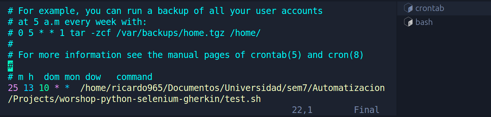
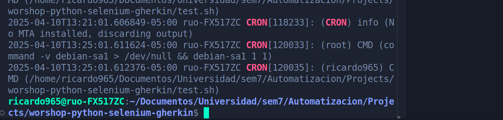

# Test Automation Workshop with Selenium, Python, Cucumber, Gherkin, and the Page Object Model (POM) Pattern.

Since we are using the **Page Object Model (POM)** design pattern, we need to define a class that contains the set of actions for each page involved in the test flow.

To successfully complete a purchase, we must include page objects for **Inventory**, **Confirmation**, and **Checkout**, each one encapsulating the methods required to interact with its respective page.

```python
from selenium.webdriver.common.by import By
from pages.base_page import BasePage

class InventoryPage(BasePage):
    INVENTORY_CONTAINER = (By.ID, "inventory_container")
    CART_BUTTON = (By.ID, "shopping_cart_container")

    def is_inventory_page_displayed(self):
        return self.wait_for_element(self.INVENTORY_CONTAINER).is_displayed()

    def add_product_to_cart(self, product_name):
        product_locator = (By.XPATH, f"//div[text()='{product_name}']/ancestor::div[@class='inventory_item']//button")
        self.click(product_locator)

    def go_to_cart(self):
        self.click(self.CART_BUTTON)


from selenium.webdriver.common.by import By
from pages.base_page import BasePage

class ConfirmationPage(BasePage):
    CONFIRMATION_MESSAGE = (By.XPATH, "//h2[contains(text(),'Thank you for your order!')]")

    def get_confirmation_message(self):
        return self.get_text(self.CONFIRMATION_MESSAGE)


from selenium.webdriver.common.by import By
from pages.base_page import BasePage

class CheckoutPage(BasePage):
    CHECKOUT_BUTTON = (By.ID, "checkout")
    FIRST_NAME_INPUT = (By.ID, "first-name")
    LAST_NAME_INPUT = (By.ID, "last-name")
    POSTAL_CODE_INPUT = (By.ID, "postal-code")
    CONTINUE_BUTTON = (By.ID, "continue")
    FINISH_BUTTON = (By.ID, "finish")

    def proceed_to_checkout(self):
        self.click(self.CHECKOUT_BUTTON)

    def enter_customer_info(self, first_name, last_name, postal_code):
        self.type(self.FIRST_NAME_INPUT, first_name)
        self.type(self.LAST_NAME_INPUT, last_name)
        self.type(self.POSTAL_CODE_INPUT, postal_code)
        self.click(self.CONTINUE_BUTTON)

    def finish_purchase(self):
        self.click(self.FINISH_BUTTON)


```

---

Next, using **Gherkin**, we define the scenario and steps required to run the test. Gherkin not only acts as a guide but also provides test data such as the selected product, user name, and other details. Here's the scenario:

```gherkin
Feature: Compra de un producto en SauceDemo

  Scenario: Usuario inicia sesión, agrega un producto y completa la compra
    Given the user is on the login page
    When the user logs in with valid credentials
    Then the user should be redirected to the inventory page

    When the user adds "Sauce Labs Backpack" to the cart
    And proceeds to checkout
    And enters shipping details "Juan" "Pérez" "12345"
    And completes the purchase
    Then the confirmation message "Thank you for your order!" should be displayed

```

Using these Gherkin steps, we then define the corresponding step definitions that interact with the POM classes to simulate the actual application flow on the checkout_steps.py:

```python
from behave import when, then
from pages.inventory_page import InventoryPage
from pages.checkout_page import CheckoutPage
from pages.confirmation_page import ConfirmationPage

@when('the user adds "{product_name}" to the cart')
def step_add_product_to_cart(context, product_name):
    if not hasattr(context, "inventory_page"):  # Verifica si ya existe
        context.inventory_page = InventoryPage(context.driver)  # Inicializa solo si no existe
    context.inventory_page.add_product_to_cart(product_name)

@when('proceeds to checkout')
def step_proceed_to_checkout(context):
    if not hasattr(context, "inventory_page"):  # Asegura que esté inicializado
        context.inventory_page = InventoryPage(context.driver)
    context.inventory_page.go_to_cart()
    context.checkout_page = CheckoutPage(context.driver)
    context.checkout_page.proceed_to_checkout()

@when('enters shipping details "{first_name}" "{last_name}" "{postal_code}"')
def step_enter_shipping_details(context, first_name, last_name, postal_code):
    context.checkout_page.enter_customer_info(first_name, last_name, postal_code)

@when('completes the purchase')
def step_complete_purchase(context):
    context.checkout_page.finish_purchase()
    context.confirmation_page = ConfirmationPage(context.driver)

@then('the confirmation message "{message}" should be displayed')
def step_verify_confirmation_message(context, message):
    assert message in context.confirmation_page.get_confirmation_message()
    context.driver.quit()

```

Once the test is defined, it can be executed using the command `behave`.

It's important to note that the **WebDriver instance must be passed through the context** to properly apply configurations such as blocking popups or handling browser options.

```python
# Configuration to suppress popups and security warnings
options.add_argument("--disable-infobars")
options.add_argument("--disable-notifications")
options.add_argument("--password-store=basic")
options.add_argument("--headless")  # Useful for GitHub Actions
options.add_argument("--no-sandbox")  # Required in container environments
options.add_argument("--disable-dev-shm-usage")  # Avoids shared memory issues
options.add_argument("--disable-gpu")  # GPU compatibility

options.add_argument("--disable-features=PasswordProtectionService")
options.add_argument("--disable-features=PasswordLeakDetection")

user_data_dir = os.path.join(tempfile.gettempdir(), 'chrome_profile')
options.add_argument(f"--user-data-dir={user_data_dir}")

# Experimental options to suppress additional warnings
options.add_experimental_option("prefs", {
    "credentials_enable_service": False,
    "profile.password_manager_enabled": False,
    "profile.password_manager_leak_detection": False,
    "profile.default_content_setting_values.notifications": 2,
    "safebrowsing.enabled": False,
    "safebrowsing.disable_download_protection": True,
    "credentials_enable_autosignin": False
})
```

Additionally, this line is required:

```python
service = Service(ChromeDriverManager().install())
```

This ensures that when the pipeline agent runs the test, it can automatically install the appropriate ChromeDriver to interact with the webpage.

---

GitHub Actions Pipeline

The following GitHub Actions pipeline runs the test suite whenever a pull request is made to the `main` branch. It ensures everything is executed in a Python virtual environment, with the required packages installed including `selenium`, `behave`, and `webdriver-manager`.

It also uses `behave --format json --out reports/report.json` to generate a test report, which is uploaded as an artifact using `actions/upload-artifact@v4`. This artifact is stored as a **blob** (Binary Large Object) in GitHub.

```yaml
name: Run Selenium Tests with Behave

on:
  pull_request:
    branches:
      - main

jobs:
  test:
    runs-on: ubuntu-latest

    steps:
      - name: Checkout Repository
        uses: actions/checkout@v4

      - name: Set up Python
        uses: actions/setup-python@v4
        with:
          python-version: "3.12"

      - name: Install Dependencies
        run: |
          python -m venv venv   
          source venv/bin/activate
          pip install --upgrade pip
          pip install selenium behave
          pip install webdriver-manager

      - name: Run Behave Tests
        run: |
          source venv/bin/activate
          mkdir -p reports
          behave --format json --out reports/report.json

      - name: Upload Test Reports
        uses: actions/upload-artifact@v4
        with:
          name: test-reports
          path: reports/
```

---

## Adding a CRON Job

First, use the command `crontab -e` to create a CRON job. In this case, we want it to run every **7th day of the month at 15:48**.



This CRON job is configured to execute a script that runs our automated tests. The script looks like this:

```bash
#!/bin/bash

# Ir al directorio del script
cd "$(dirname "$0")"
source ./venv/bin/activate
cd .
behave >> ./output.txt 2>&1
deactivate
```

We can check whether the test ran correctly by inspecting the output log:

### Script Result

Output of `output.txt`:

```text
Feature: Compra de un producto en SauceDemo # features/checkout.feature:1

  Scenario: Usuario inicia sesión, agrega un producto y completa la compra        # features/checkout.feature:3
    Given the user is on the login page                                           # features/steps/login_steps.py:6
    When the user logs in with valid credentials                                  # features/steps/login_steps.py:11
    Then the user should be redirected to the inventory page                      # features/steps/login_steps.py:24
    When the user adds "Sauce Labs Backpack" to the cart                          # features/steps/checkout_steps.py:6
    And proceeds to checkout                                                      # features/steps/checkout_steps.py:12
    And enters shipping details "Juan" "Pérez" "12345"                            # features/steps/checkout_steps.py:20
    And completes the purchase                                                    # features/steps/checkout_steps.py:24
    Then the confirmation message "Thank you for your order!" should be displayed # features/steps/checkout_steps.py:29

Feature: Login Feature # features/login.feature:1

  Scenario: Successful login with valid credentials          # features/login.feature:2
    Given the user is on the login page                      # features/steps/login_steps.py:6
    When the user logs in with valid credentials             # features/steps/login_steps.py:11
    Then the user should be redirected to the inventory page # features/steps/login_steps.py:24

  Scenario: Unsuccessful login with invalid credentials  # features/login.feature:7
    Given the user is on the login page                  # features/steps/login_steps.py:6
    When the user logs in with invalid credentials       # features/steps/login_steps.py:16
    Then an error message should be displayed            # features/steps/login_steps.py:28

  Scenario: Empty login credentials              # features/login.feature:12
    Given the user is on the login page          # features/steps/login_steps.py:6
    When the user logs in with empty credentials # features/steps/login_steps.py:20
    Then an error message should be displayed    # features/steps/login_steps.py:28

2 features passed, 0 failed, 0 skipped
4 scenarios passed, 0 failed, 0 skipped
17 steps passed, 0 failed, 0 skipped, 0 undefined
Took 0m1.244s

```

Additionally, by running the following command, we can verify that CRON executed the job:

```bash
grep CRON /var/log/syslog
```

Which provides confirmation like this:


